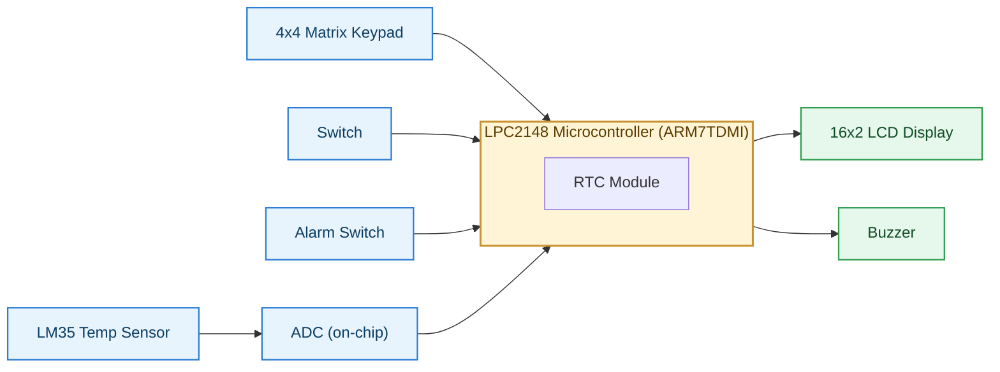
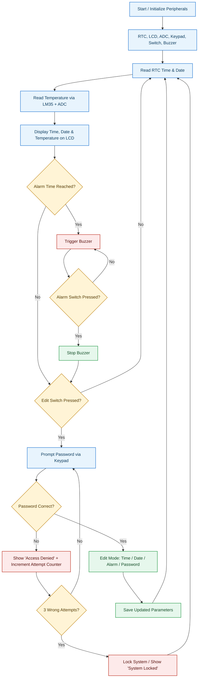
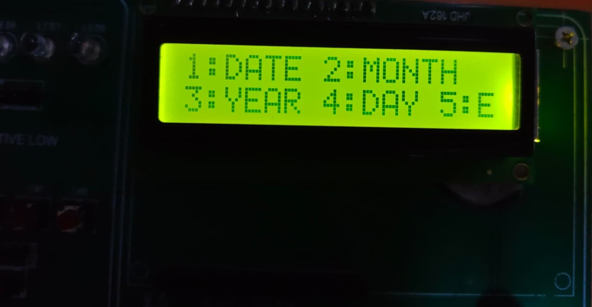
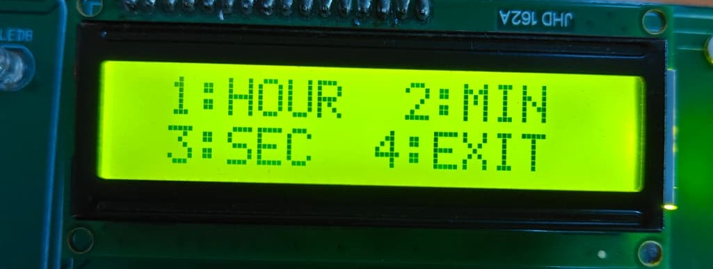
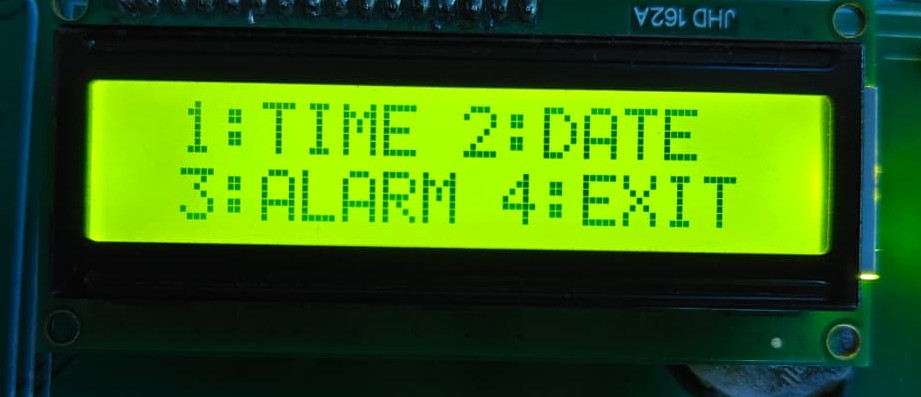
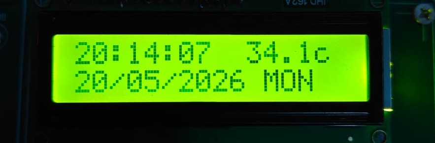

# ⏱️ EnviroTime — Digital Clock with Real-Time Temperature Monitoring

An embedded systems project built on the **NXP LPC2148 (ARM7TDMI)** microcontroller that displays live time/date on a 16×2 LCD, monitors ambient temperature using an **LM35** sensor, and supports secure, password-protected editing of time, date, and alarm settings via a **4×4 matrix keypad**.

**Author:** B Guru Prased
**GitHub:** [github.com/bestaguruprasad](https://github.com/bestaguruprasad)
**Demo Video:** [Watch on Google Drive](https://drive.google.com/file/d/1tC6KVXNJx8RefNU4UkUtCmXAMAUTuRDw/view?usp=drivesdk)

---

## 📌 Overview

EnviroTime continuously displays real-time clock data (hour, minute, second, date, day, month, year) alongside live ambient temperature, and raises a buzzer alert when a user-set alarm time is reached. All configuration changes are gated behind a keypad password, with lockout after repeated failed attempts.

## ✨ Features

- Real-Time Clock (RTC) display — time, date, day, month, year
- Live temperature monitoring via LM35 sensor + on-chip ADC
- 16×2 LCD output with continuously refreshed data
- Alarm setting with buzzer notification
- Password-protected edit mode (via 4×4 matrix keypad)
- Auto lockout after 3 incorrect password attempts
- Switch-based polling to enter/exit edit mode

## 🛠️ Hardware Requirements

| Component | Purpose |
|---|---|
| LPC2148 (ARM7TDMI) | Main microcontroller |
| 16×2 LCD | Display output |
| 4×4 Matrix Keypad | User input / password entry |
| LM35 Temperature Sensor | Ambient temperature sensing |
| Push Switches | Edit mode / alarm control |
| Buzzer | Alarm & security alerts |
| USB–UART Converter / DB-9 Cable | Programming & serial interface |

## 💻 Software Requirements

- Embedded C
- **Keil µVision** (ARM-ADS toolchain, target device: **LPC2129/LPC2148 family**, project schema v1.0 — µVision4/µVision5 compatible `.uvproj`)
- Flash Magic (for flashing the `.hex` file to the board)

---

## 🧩 Block Diagram



## 🔄 System Flow Chart



---

## 📷 Screenshots

| Main Display | Main Menu |
|---|---|
|  |  |

| Time Edit Menu | Date Edit Menu |
|---|---|
|  |  |

---

## 🎥 Demo Video

📽️ [Click here to watch the project demo](https://drive.google.com/file/d/1tC6KVXNJx8RefNU4UkUtCmXAMAUTuRDw/view?usp=drivesdk)

---

## 📂 Repository Structure

```
EnviroTime/
├── README.md
├── docs/
│   └── EnviroTime_Documentation.pdf     # Full project documentation (AIM, objectives, workflow)
├── firmware/                            # Keil uVision project
│   ├── mini_project.uvproj              # Keil project file
│   ├── mini_project.uvopt               # Keil options file
│   ├── src/                             # Source files (.c / .s)
│   │   ├── project.c                    # Main application logic
│   │   ├── lcd.c                        # LCD driver
│   │   ├── kpm.c                        # Matrix keypad driver
│   │   ├── adc.c                        # ADC driver
│   │   ├── LM35.c                       # Temperature sensor
│   │   ├── menu.c                       # Menu handling
│   │   ├── delay.c                      # Delay routines
│   │   ├── rtc_test.c                   # RTC handling
│   │   ├── adc_lcd_test.c
│   │   └── Startup.s                    # ARM7 startup code
│   └── include/                         # Header files (.h)
│       ├── project.h
│       ├── lcd.h / lcd_defines.h
│       ├── kpm.h / kpm_defines.h
│       ├── adc.h / adc_defines.h
│       ├── LM35.h
│       ├── menu.h
│       ├── delay1.h
│       ├── defines.h
│       └── types.h
└── screenshots/
```

## 📖 Documentation

Full project documentation (aim, objectives, block diagram, requirements, and detailed system working) is available here: **[docs/EnviroTime_Documentation.pdf](docs/EnviroTime_Documentation.pdf)**

## 🚀 How to Build & Flash

1. Open `firmware/mini_project.uvproj` in **Keil µVision**.
2. Under **Project → Options → C/C++ → Include Paths**, make sure `firmware/include` is added (required since headers now live in a separate folder).
3. Build the project — this compiles the source files and generates the `.hex` output.
4. Connect the LPC2148 board via USB-UART/DB-9.
5. Flash the generated `.hex` file using **Flash Magic**.
6. Power on the board — the LCD will start displaying time, date, and temperature.

---

⭐ If you found this project useful, consider giving the repository a star!
